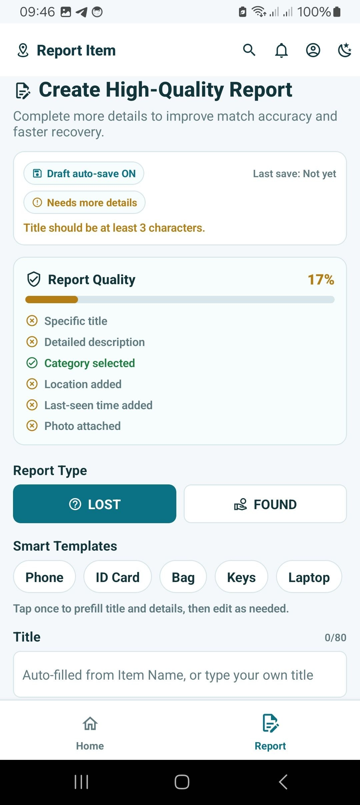
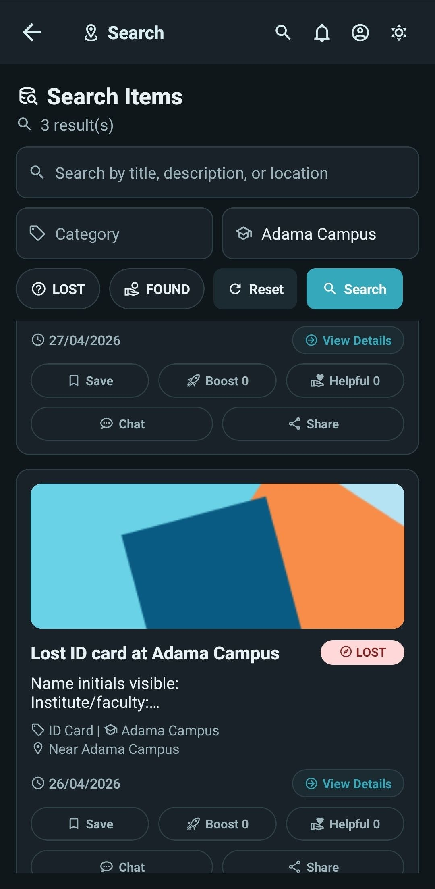

# Screen Gallery

This gallery uses screenshots from `docs/doc_image` for GitHub-visible documentation.

## Home

How it works: Loads active reports and lets users scan, open, and act on items quickly.

Architecture: `HomeScreen` + `ItemsContext` + `itemService.list` + backend item list API.

UI/UX: Card-first visual hierarchy and motion support fast browsing.

Display Note: Main feed with quick-scan cards and action-ready item discovery.

Display Note: Feed variant emphasizing visual continuity and browsing rhythm.

## Login

How it works: Authenticates user and unlocks protected flows (report, chat, save, verify).

Architecture: `LoginScreen` + `AuthContext` + `authService` + auth API.

UI/UX: Minimal form and clear action button to reduce login friction.

Display Note: Authentication gateway for secure session-based usage.

## Report Flow

How it works: Collects item details, safety metadata, image, and location, then creates a report.

Architecture: `ReportItemScreen` + `ItemsContext.createReport` + item create API + `Item` model.

UI/UX: Guided sections, validation feedback, and confidence checks improve report quality.

Display Note: High-quality report workflow with structured form guidance.

Display Note: Lost-item state with identity and recovery safety emphasis.

Display Note: Combined template flow for lost and found report types.

## Search / Found Items

How it works: Filters and searches reports to find the best possible match.

Architecture: `SearchScreen` + query filters + `itemService.list(query)` + list query builder in backend.

UI/UX: Search narrowing and scan-friendly rows reduce effort and time.

Display Note: Filter-based search results for faster potential-match discovery.

## Account

How it works: Provides personal profile/settings access and app preference controls.

Architecture: `AccountScreen` + `AuthContext` + `ThemeContext` + local storage services.

UI/UX: Consistent settings layout in light/dark themes supports clarity and comfort.

Display Note: Personal profile and settings center.

Display Note: Dark-mode profile experience for mobile comfort and contrast.

## Alerts

How it works: Displays important system events like matches and moderation updates.

Architecture: `NotificationsScreen` + notification service/API + `Notification` model.

UI/UX: Event-priority list keeps users focused on actions that matter most.

Display Note: Chronological alerts stream with actionable status updates.
